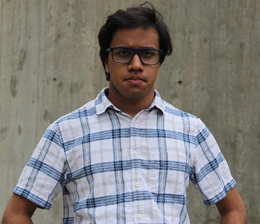

Kalana Amarasekara: My Accessibility Project
===
 
 
 
My name's **Kalana Amarasekara**. I'm a junior at the University of Massachusetts and I write for the [Massachusetts Daily Collegian](https://dailycollegian.com/staff_name/kalana-amarasekara/). My accessibility project focuses on how digital media can be made more accessible not simply for people with disabilities but for _everyone_. It focuses on the concept of universal design, which in this context makes digital design equitable and can meet different people's needs. 

My Focus: Video Transcripts
---

Thus far, my teammates and I have written about how video transcripts can contribute to universally accessible web material. Video transcripts can be useful because they:

* Allow people to read the text of a video and 
* Navigate to certain points of a video with ease. 

In some instances, reading transcripts will require the use of screen readers, and semantic elements will allow them to be presented clearly. 

😂😂😂
